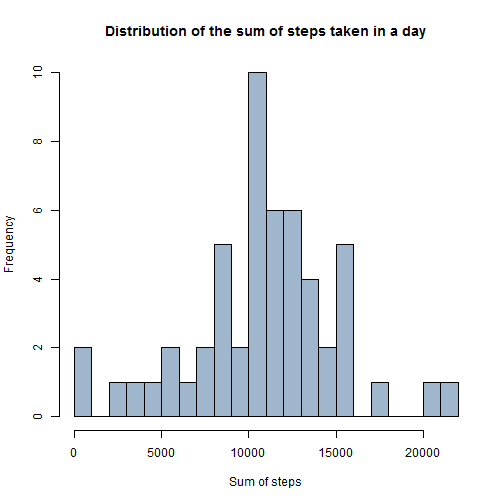
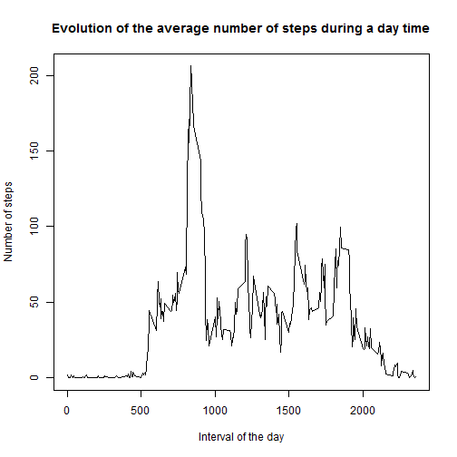
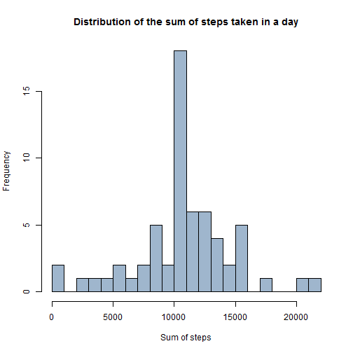
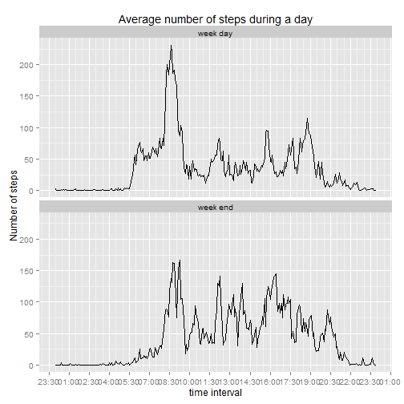

## Loading and preprocessing the data
Please make sure that your working directory contains the current file and the file "activity.zip". The loading of the data is straight forward. and the "Data Processing" part is a little of processing of the date and time, to make an new variable "date.complete" as a POSIXct variable. This step is not mandatory, but it helps producing a better graph at the end of the present document


```r
unzip('activity.zip')

#Reading the data
data <- read.csv('activity.csv', header = T, quote = "\" ", na.strings = "NA")

#Data preprocessing
data[,2] <- as.Date(data[,2], format = "%Y-%m-%d")
interval_fix <- format(data$interval, width = 4)
interval_fixed <- chartr(" ", "0", interval_fix)
hour = paste(substr(interval_fixed,1,2),substr(interval_fixed,3,4), sep=":")
data$date.complete <- as.POSIXct(paste(data$date, hour), format = "%Y-%m-%d %H:%M")
```


## What is mean total number of steps taken per day?
A stated in the description of the assigment, NA values are not taken into account for this part

### 1. Total number of steps taken per day
The *aggregate* function gets rid of NA values and compute the sum of steps with respect to the variable date. The result is store in the data frame **Total**. *NB* : the warning and messages from the loading of dplyr are hidden

```r
library(dplyr)
Total <- aggregate(steps~date, data, FUN = sum)
```

### 2. Distribution of the sum of steps made in a day
This histogram shows the distribution of the sum of steps made during the 61 studied days

```r
hist(Total[,2], breaks = 30, main = "Distribution of the sum of steps taken in a day"
     ,col = 'slategray3', xlab = "Sum of steps")
```

 

### 3. Mean and median of the total number of steps taken per day

```r
list(Mean.Daily.Steps = mean(Total$steps),Median.Daily.Steps = median(Total$steps))
```

```
## $Mean.Daily.Steps
## [1] 10766.19
## 
## $Median.Daily.Steps
## [1] 10765
```

## What is the average daily activity pattern?

### 1. Time series plot
*aggregate* is now used with the variable interval. The average numbers of steps through the days taken in every interval are stored in the data frame **Total.interval**. The pattern seems relevant : the user does not walk during night time and appears to have a high activity in the morning

```r
Total.interval <- aggregate(steps~interval, data, FUN = mean) 
plot(Total.interval$interval, Total.interval$steps, type = 'l', xlab='Interval of the day',
     ylab = 'Number of steps',main = "Evolution of the average number of steps during a day time")
```

 

### 2. Interval of the maximum average number of steps
Averaged through the days, the interval with the maximum activity in terms of steps is 08:35. It may corresponds to the time of departure to the user's workplace

```r
list(Max.Interval = Total.interval[Total.interval$steps == max(Total.interval$steps), 'interval'])
```

```
## $Max.Interval
## [1] 835
```

## Imputing missing values

### 1. Number of NA values

```r
list(Number.of.NA.steps = sum(is.na(data$steps)))
```

```
## $Number.of.NA.steps
## [1] 2304
```
As a result 0.1311475% of the variable "steps" is composed by NA values

### 2&3. Filling NA values
In order to fill in the data set, NA values were replaced by the according mean value for that particular 5 min interval. As a result, the mean value of steps talen in a day will not be affected. The data set without any NA values is stores in the data frame **data.NA.filled**. *NB* : the function *rep* here is used as a trick, to distribute the mean values in all the missing values that can be across several days

```r
data.NA.filled = data
data.NA.filled$steps[is.na(data$steps)] <- rep(Total.interval$steps,times = 17568/288)[is.na(data$steps)]
```

### 4. Histogram, mean and median values
The computation and codes are the same as previously. One notices that the mean is not changed, which confirms our missing value handling. Moreover, since every interval contained at least one NA value, the median is not an integer anymore, and it is consequently equal to the mean value

```r
Total.NA.filled <- aggregate(steps~date, data.NA.filled, FUN = sum)

hist(Total.NA.filled[,'steps'], breaks = 30, main = "Distribution of the sum of steps taken in a day"
     ,col = 'slategray3', xlab = "Sum of steps")
```

 

```r
list(Mean.Daily.Steps.NA.filled = mean(Total.NA.filled$steps),
     Median.Daily.Steps.NA.filled = median(Total.NA.filled$steps))
```

```
## $Mean.Daily.Steps.NA.filled
## [1] 10766.19
## 
## $Median.Daily.Steps.NA.filled
## [1] 10766.19
```

The result of this choice of missing value handling are visible on the standard deviation of the distribution. This later decreases because we increased the sample size, by adding new values closer to the mean of the distribution

```r
list(Sd.Daily.Steps = sd(Total$steps), Sd.Daily.Steps.NA.filled = sd(Total.NA.filled$steps))
```

```
## $Sd.Daily.Steps
## [1] 4269.18
## 
## $Sd.Daily.Steps.NA.filled
## [1] 3974.391
```

## Are there differences in activity patterns between weekdays and weekends?

### 1. A new variable
*WARNING* The code was written on a French machine, under a French license, so I apologize for the name of the days, it may create troubles on a non French machine. If so, please change "samedi" by "saturday" and "dimanche" by "sunday". There is an alternative option with the package *lubridate* but it is not always installed on machines.  
Now the data set has a new variable "daytype"

```r
data.NA.filled$daytype[weekdays(data.NA.filled$date) == 'dimanche' | weekdays(data.NA.filled$date)=='samedi'] = 'week end' 
data.NA.filled$daytype[!(weekdays(data.NA.filled$date) == 'dimanche' | weekdays(data.NA.filled$date)=='samedi')] = 'week day' 
data.NA.filled$daytype <- as.factor(data.NA.filled$daytype)
data.NA.filled$interval <- as.factor(data.NA.filled$interval)
data.NA.filled<- group_by(data.NA.filled,daytype,interval)
```
### 2. Panel time series plot
The plot itself is easy, but for aesthetic reasons, a trick is used to just display the certain hours during a day, and not all the 5 min intervals to make it readable. There is a difference in pattern between weekdays and week ends.

```r
library(ggplot2)
library(scales)

interm <- summarize(data.NA.filled, test = mean(steps))
p <- ggplot(data = interm, aes(x=rep(data$date.complete[1:288], times = 2),y=test,group=1))+ geom_line()
p + facet_wrap(~daytype,ncol = 1)+ xlab('time interval')+ylab('Number of steps')+ 
    ggtitle("Average number of steps during a day")+scale_x_datetime(breaks = date_breaks("90 min"), minor_breaks=date_breaks("30 min"), labels=date_format("%H:%M"))
```

 

